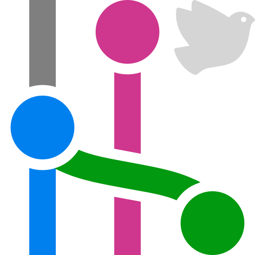

  
  <samp>
    <h1>Git Graph Libre for Visual Studio Code</h1>
    <h3>Visual git history, branch actions, and devcontainer support. A copyleft fork continuing Git Graph's MIT lineage.</h3>
  </samp>

<!-- Badges to restore after publication (with the new publisher/repo IDs):
     GitHub release, marketplace downloads/installs -->

## Features

- **Graph view**: See branches, tags, and uncommitted changes in one graph
- **History recovery**: Keep detached HEAD visible and optionally discover unreachable commits
- **Commit details**: Click a commit to see message, files, and diffs
- **Branch actions**: Create, checkout, rename, delete, and merge
- **Tag actions**: Create, push, view details, and delete locally or on selected
  remotes; signed tags are marked with a verified badge in the graph
  - Tag types: lightweight tags are a plain ref with no tag object, so they are
    unsigned by definition and carry no message; annotated tags follow your git
    signing configuration (`tag.gpgSign`, `user.signingkey`, `gpg.format`)
- **Commit actions**: Checkout, cherry-pick, revert, and reset
- **Avatar support**: Optional avatars from GitHub, GitLab, or Gravatar
- **Multi-repo**: Work with multiple repositories in one workspace
- **Devcontainer ready**: Works in remote and container environments
- **Internationalization**: English, Dutch, Polish, zh-CN, and zh-TW

## Why this fork

The original [Git Graph](https://github.com/mhutchie/vscode-git-graph) by
mhutchie left the MIT license in May 2019 — everything after
[commit 4af8583](https://github.com/mhutchie/vscode-git-graph/commit/4af8583a42082b2c230d2c0187d4eaff4b69c665)
is under more restrictive terms. This fork descends from that last MIT commit
via [asispts/neo-git-graph](https://github.com/asispts/neo-git-graph) and adds
devcontainer support, internationalization, and a modernized codebase and
toolchain.

From version 1.0.0 the project is licensed under the GNU AGPL-3.0-or-later.
Copyleft guarantees this fork stays open: anyone may redistribute or build on
it, but every distributed or network-hosted derivative must keep its complete
source available under the same terms. See
[docs/LICENSING.md](docs/LICENSING.md) for the full licensing strategy and
provenance.

## Installation

Marketplace listings are coming soon — this fork has not been published yet.
Once it is, it will be available from:

- VS Code Marketplace: _link to follow after publication_

Until then, you can build and install it locally: `pnpm install`, package the
bundled extension with `pnpm exec vsce package --no-dependencies`, then in VS
Code run `Extensions: Install from VSIX...`.

## Configuration

All settings use the `git-graph-libre` prefix.

| Setting                                        | Default         | Description                                      |
| ---------------------------------------------- | --------------- | ------------------------------------------------ |
| `autoCenterCommitDetailsView`                  | `true`          | Center commit details when opened                |
| `dateFormat`                                   | `"Date & Time"` | `"Date & Time"`, `"Date Only"`, or `"Relative"`  |
| `dateType`                                     | `"Author Date"` | `"Author Date"` or `"Commit Date"`               |
| `fetchAvatars`                                 | `false`         | Fetch avatars (sends email to external services) |
| `graphColors`                                  | 12 defaults     | Colors for graph lines                           |
| `graphStyle`                                   | `"rounded"`     | `"rounded"` or `"angular"`                       |
| `initialLoadCommits`                           | `300`           | Commits to load on open                          |
| `loadMoreCommits`                              | `100`           | Commits to load on demand                        |
| `maxDepthOfRepoSearch`                         | `0`             | Folder depth for repo search                     |
| `repository.boldCheckedOutCommit`              | `false`         | Bold the checked-out commit's message            |
| `repository.fetchTagsByDefault`                | `true`          | Pre-check "Fetch all tags" in the Fetch dialog   |
| `repository.includeReflog`                     | `false`         | Include commits referenced only by reflogs       |
| `repository.includeUnreachableCommits`         | `false`         | Scan for unreachable commits in Show All         |
| `repository.muteMergeCommits`                  | `false`         | Mute merge commit messages (opt-in)              |
| `showCurrentBranchByDefault`                   | `false`         | Show only current branch on open                 |
| `showStatusBarItem`                            | `true`          | Show status bar button                           |
| `showUncommittedChanges`                       | `true`          | Show uncommitted changes node                    |
| `telemetry.enabled`                            | `"unset"`       | `unset` / `enabled` / `disabled` — see below     |
| `tabIconColorTheme`                            | `"color"`       | `"color"` or `"grey"`                            |

## Telemetry

This extension can send anonymous usage data so development can be aimed at
the features people actually use. It asks first and sends nothing until you
answer. It is a hobby project with no company behind it, and the data goes to a
small self-hosted service at `t.plohnensoftware.download` — never to a
third-party analytics provider.

**What is sent**

- Which command or action ran (for example `pushTag`), and whether it succeeded.
- Once per session: whether a feature that works by *showing* something was
  actually in effect — recovered history (reflog-only or unreachable commits)
  appearing in the graph, or a signed tag being there to badge. These are
  recorded once, not once per refresh.
- Once per session: which settings you have changed from their defaults — only
  *that* they were changed, never what you changed them to.
- The properties Visual Studio Code attaches to every extension telemetry
  event: extension and VS Code version, product (Code, Insiders, VSCodium,
  Cursor), whether this is a new installation, and anonymized machine, session,
  and device identifiers generated by VS Code itself.
- Your operating system, processor architecture, and the numeric part of your
  OS version (`linux` / `x64` / `7.2.2`, with any build or distribution suffix
  stripped). Visual Studio Code does not attach these itself, so the extension
  adds them.

**What is never sent**

File names, file paths, workspace or folder names, repository names, git remote
URLs, branch names, tag names, commit hashes, commit messages, author names,
email addresses, environment variables, credentials, or your list of installed
extensions. The receiving service stores no IP addresses.

**Nothing is sent until you say so**

`git-graph-libre.telemetry.enabled` has three states and starts at `unset`:

| State      | What happens                                            |
| ---------- | ------------------------------------------------------- |
| `unset`    | Nothing is sent. The default — no answer is not a yes.  |
| `enabled`  | Feature-usage data is sent, subject to the switch below |
| `disabled` | Nothing is sent.                                        |

The extension asks once when it activates, and again whenever you open the
graph, until you answer. Closing the notification without choosing is not an
answer: the state stays `unset` and nothing is sent.

While the question is open the graph is not shown — you get a screen saying
what is being waited for, with a **Set now** button that brings the
notification back if you dismissed it. Answer it either way and the graph
opens; `disabled` is a complete answer and costs you nothing.

Visual Studio Code's own `telemetry.telemetryLevel` setting always wins on top
of that: while it is off, nothing is sent no matter which state the setting
above is in. If you accept while that switch is off, the extension says so and
offers to open the setting rather than storing a preference that cannot take
effect.

Run `code --telemetry` to see the full declaration of what this extension
collects, alongside every other extension you have installed.

## License

GNU Affero General Public License v3.0 or later (`AGPL-3.0-or-later`) — see
[LICENSE](LICENSE). This fork incorporates MIT-licensed material from the
original Git Graph lineage; the required MIT notices and per-era contributor
rosters are preserved in [LICENSE.mit](LICENSE.mit) and credited in
[NOTICE.md](NOTICE.md).

> This project is not affiliated with or endorsed by the original Git Graph
> project or its maintainer.
